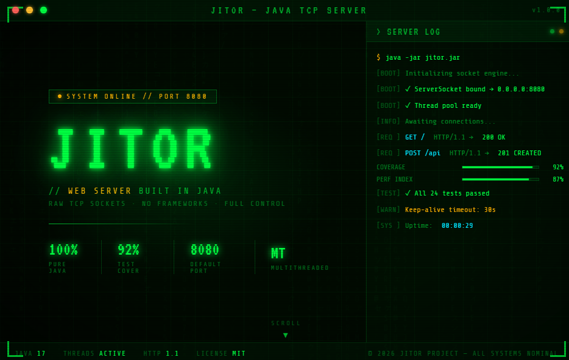

# Jitor - Java HTTP Server

## Overview

This repository contains a small HTTP server written from scratch in Java as a learning project.

Today, the project is a **minimal socket-based server prototype**: it accepts connections, parses basic HTTP requests, and serves HTML files for two route outcomes (`/` or not found).

## Current Features (Implemented)

- TCP server using `ServerSocket`
- Fixed thread pool for concurrent request handling
- Basic HTTP request parsing:
  - request line (`method`, `path`)
  - headers
  - optional body via `Content-Length`
- Basic HTTP response writing with status line + headers + body
- Static HTML response behavior:
  - `GET /` or `GET /index.html` -> serves `index.html`
  - any other path -> serves `404.html`
- Simple console logger with timestamp and level (`INFO`, `ERROR`)
- **Unit Tests**: Comprehensive unit tests for HTTP request and response parsing
- **Integration Tests**: Integration tests for the complete HTTP server workflow

## Project Structure

```text
JavaHttpServer/
  README.md
  code/
    pom.xml
    src/
      main/
        java/
          Main.java                    # Application entry point
          logging/
            Logger.java                # Console logger utility
          server/
            HttpServer.java            # TCP server with thread pool
            HttpRequest.java           # HTTP request parser
            HttpResponse.java          # HTTP response builder
        resources/
          public/
            index.html                 # Home page (served on GET /)
            404.html                   # Not found page
            img.png                    # Static image assets
            fullprint.png
      test/
        java/
          unit/
            HttpRequestTest.java       # Unit tests for request parsing
            HttpResponseTest.java      # Unit tests for response building
          integration/
            HttpServerIntegrationTest.java  # End-to-end server tests
    target/                            # Compiled output (generated by Maven)
```

### Key Components

- **Main.java**: Entry point that initializes the HTTP server on port 8080 with a fixed thread pool
- **HttpServer.java**: Core server logic handling socket connections and request routing
- **HttpRequest.java**: Parses raw HTTP requests into structured data
- **HttpResponse.java**: Builds and serializes HTTP responses
- **Logger.java**: Simple logging utility with timestamp and severity levels
- **Unit Tests**: Test individual components in isolation
- **Integration Tests**: Test complete request/response workflows

## How It Works

1. `Main` creates `server.HttpServer(8080, 2)` and starts it.
2. `server.HttpServer` listens on port `8080`.
3. Each accepted socket is handled by the fixed thread pool.
4. `server.HttpRequest.parse(...)` reads request line, headers, and optional body.
5. `server.HttpServer` chooses which HTML file to return based on the path.
6. `server.HttpResponse` writes an HTTP/1.1 response to the socket output stream.

## Run Locally

### Compile and Run the Server

From the repository root:

```powershell
mvn -f "C:\dev\projects\JavaHttpServer\code\pom.xml" clean compile
java -cp "C:\dev\projects\JavaHttpServer\code\target\classes" Main
```

Then open:

- `http://localhost:8080/`
- `http://localhost:8080/any-other-path` (returns the 404 page)

### Run Tests

#### Run All Tests

```powershell
mvn -f "C:\dev\projects\JavaHttpServer\code\pom.xml" test
```

#### Run Unit Tests Only

```powershell
mvn -f "C:\dev\projects\JavaHttpServer\code\pom.xml" test -Dtest=*Test
```

#### Run Integration Tests Only

```powershell
mvn -f "C:\dev\projects\JavaHttpServer\code\pom.xml" test -Dtest=*IntegrationTest
```

## Requirements

- Maven
- Java version compatible with `code/pom.xml` (currently set to source/target `25`)

## Purpose

This project is focused on learning fundamentals:

- sockets and network I/O in Java
- HTTP request/response flow
- basic concurrency with thread pools
- server architecture concepts before using full frameworks
